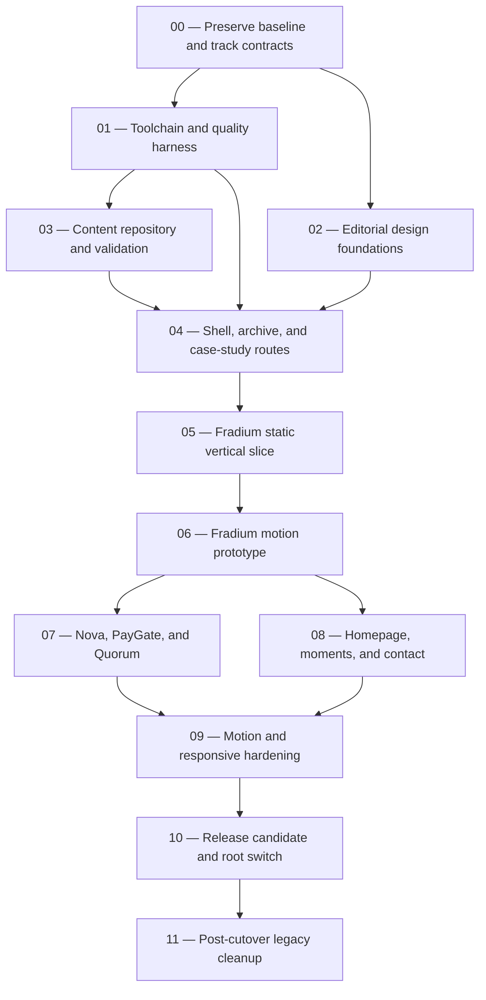

# GitHub Issue Breakdown

Date: 11 July 2026
Status: **approved backlog; Issues #1, #3, #5, and #7 are in implementation**

The implementation should use the standard issue-driven workflow. These are high-signal delivery slices, not activity placeholders. Replace `TBD` with the real GitHub issue number before creating a branch, and link each PR with `Closes #N`.

## Dependency map



Issues 01 and 02 may proceed in parallel after issue 00. Issue 03 begins after issue 01 because it consumes the pinned runtime, test runner, scripts, and lockfile; all three must merge before issue 04.

## 00 - Preserve baseline and make the new blueprint canonical

**Suggested title:** `chore: preserve V5 baseline and promote V1 portfolio contracts`
**Risk:** standard
**GitHub issue:** [#1](https://github.com/wildanniam/portofolio-wildan/issues/1)
**Implementation branch:** `codex/1-portfolio-contracts`

Scope:

- preserve the two existing user-modified migration targets;
- record the exact baseline branch and SHA, preserve the dirty user work in an approved safety commit/branch or exported patch, and require every implementation branch to start from the agreed clean base;
- capture baseline desktop/mobile screenshots and bundle/build/a11y notes;
- move or copy the approved design, content, architecture, motion, and development contracts into tracked docs;
- mark the reactor/3D V5 docs as superseded without erasing useful history;
- replace the boilerplate README with setup and workflow guidance.

Acceptance:

- no user change is lost or silently overwritten;
- one clearly linked tracked source of truth exists;
- obsolete docs cannot be mistaken for current direction;
- README describes install, dev, build, content validation intent, QA, and contribution workflow.

Verification:

- `git diff --check`;
- documentation link check;
- confirm only intended docs/baseline artifacts changed.

## 01 — Align the toolchain and establish the quality harness

**Suggested title:** `build: align Next tooling and add portfolio quality gates`
**Risk:** high-risk because dependency upgrades can affect the entire application
**GitHub issue:** [#3](https://github.com/wildanniam/portofolio-wildan/issues/3)
**Implementation branch:** `codex/3-quality-foundation`

Scope:

- align Next.js and `eslint-config-next` compatible major versions;
- pin the supported Node/npm runtime (observed baseline: Node 20.20.2 and npm 10.8.2) through repository metadata/tooling;
- add `typecheck`, unit/content test, E2E, a11y, bundle analysis, and Lighthouse scripts;
- choose development-only test tooling compatible with the installed runtime;
- add CI for clean install, lint with zero warnings, typecheck, tests, and build;
- fix the current lint warning only after its user-modified source is preserved;
- make E2E, a11y, Lighthouse, and analysis commands self-contained: they build when required, start a production server on a documented deterministic port, wait for readiness, run, and always stop the server;
- establish one committed output method for total initial JavaScript, route-owned JavaScript, lazy enhancement chunks, CSS, and media budgets;
- calibrate final ceilings from the pinned-runtime server-only fixture; if shared runtime alone exceeds a ceiling, document and revise the ceiling transparently rather than hiding chunks or adding measurement exceptions;
- do not mix visual redesign or cleanup of legacy application, runtime, or animation dependencies into this issue; removing the obsolete ESLint compatibility package is part of the tooling migration.

Acceptance:

- a clean install reproduces the same lockfile state;
- all new commands execute locally and in CI;
- lint passes with zero warnings after the overlapping user file is safely preserved; any other tool exception is explicit and narrow;
- the dependency alignment produces no route/build regression.

Verification:

```bash
npm ci
npm run lint -- --max-warnings=0
npm run typecheck
npm run test
npm run build
```

Also execute every newly added E2E, a11y, analysis, and Lighthouse command once end-to-end, including production-server startup, readiness, and teardown.

## 02 — Implement the light editorial design foundations

**Suggested title:** `feat: establish Open Proving Ground design foundations`
**Risk:** standard
**GitHub issue:** [#5](https://github.com/wildanniam/portofolio-wildan/issues/5)
**Implementation branch:** `codex/5-editorial-foundations`

Scope:

- implement the `DESIGN.md` colors, typography, grid, spacing, rules, focus, shapes, and media treatments;
- create `SiteContainer`, `EditorialGrid`, `SectionRule`, `ActionLink`, `MetadataLine`, `EvidenceFigure`, and `EvidenceCaption`;
- create static shell prototypes for desktop, tablet, and mobile;
- remove theme switching only from the new shell path;
- keep primary content visible before hydration.

Acceptance:

- light-only foundation matches the two approved visual references;
- focus and contrast pass WCAG AA checks;
- no glow, glass, rounded-card wall, or universal eyebrow grammar appears;
- no project-specific component is introduced;
- no horizontal overflow is masked globally.

Verification:

- screenshot review at 1440×900, 768×1024, and 390×844;
- keyboard/focus review;
- automated contrast/a11y scan;
- lint, typecheck, build.

## 03 — Build the validated content and asset repository

**Suggested title:** `feat: add typed project, evidence, and moments content system`
**Risk:** standard
**GitHub issue:** [#7](https://github.com/wildanniam/portofolio-wildan/issues/7)
**Implementation branch:** `codex/7-content-repository`

Dependency: issue 01. It may proceed alongside issue 02 after the toolchain harness is merged.

Scope:

- begin with a compatibility spike proving the selected YAML/RSC MDX tooling against pinned Next 16.2.10, Turbopack, filesystem loading, static params, metadata, and allow-listed RSC components;
- implement pure Zod parsers/validators separately from the server-only repository;
- mark filesystem access with `import "server-only"` and expose type-only/client DTO boundaries so Zod/MDX code cannot enter browser chunks;
- add project, claim, validation, link, ready/planned asset, moment, profile, navigation, and homepage records;
- add referential validation and publication gates;
- seed canonical project records for `fradium`, `nova-ai`, `paygate`, and `quorum` using approved roles;
- review the current-data/GitHub inventory and seed the selected non-flagship V1 archive entries as `brief` records with their minimum public copy, role, lifecycle, dates, link state, publication state, and usable thumbnail/evidence;
- implement only schema fields and MDX/media renderers consumed by an approved V1 record;
- migrate PayGate's verified Instaward sources;
- establish the derivative pipeline and asset-license manifest; Figma Community/library assets may be technique references only unless their license and attribution are recorded;
- create in-house diagram, redaction, evidence-caption, and Open Graph templates;
- add fixture-based schema and query tests;
- wire `validate:content` into `prebuild`;
- keep URL syntax and verification metadata build-blocking, but run external reachability as a separate retrying report so X/bot protection cannot make builds nondeterministic.

Acceptance:

- `npm run validate:content` blocks broken slugs, links, required evidence, dimensions, alt text, and private/planned public media;
- homepage order is slug data, not layout code;
- `/work` can derive from the project repository without duplicate metadata;
- published brief records produce server-only route DTOs without MDX or flagship client behavior;
- UI records are serializable and contain no React icon components;
- owner attestation is accepted for personal responsibilities while third-party claims require sources.

Verification:

- positive and negative schema tests;
- referential-integrity tests;
- published/draft/preview route-query tests;
- full/brief/no-JavaScript compatibility routes and same-build runtime gate;
- output-trace isolation for repository content;
- lint, typecheck, build.

## 04 — Build the semantic shell, work archive, and case-study routes

**Suggested title:** `feat: add server-first portfolio routes and case-study template`
**Risk:** standard
**Suggested branch:** `codex/TBD-server-routes`

Dependencies: issues 01, 02, and 03.

Scope:

- make the root layout minimal, then isolate `(legacy)` and `(v1)` route-group layouts so the current dark homepage remains intact while V1 styles and chrome stay scoped;
- add the V1 skip link, header, footer, and metadata defaults without rewriting shared global tokens before cutover;
- replace `/work` and `/contact` redirects with real routes;
- verify no reachable legacy UI consumes `/api/contact`, then disable/remove the unprotected endpoint while leaving dependency cleanup for issue 11;
- add static `/work/[slug]`, `generateStaticParams`, `generateMetadata`, and `notFound()` behavior;
- add sitemap, robots, and not-found page;
- implement shared case-study structural components;
- implement `ProjectBriefPage` for published non-flagship records;
- add a static, motion-free homepage skeleton in the locked sequence;
- gate `/moments` until publishable;
- add `/preview/open-proving-ground`, available only when `PORTFOLIO_V1_PREVIEW=1` and valid secret-backed Basic credentials are present, with `private, no-store`, `noindex`, and no navigation/sitemap entry.

Acceptance:

- required routes work directly and through navigation;
- all critical route content is server rendered;
- no-JavaScript navigation and case-study reading work;
- headings, landmarks, canonical URLs, and metadata are correct;
- a project route uses the shared template rather than project-specific layout code.
- draft project routes remain absent publicly; preview routes work only under the preview environment until real evidence is ready;
- env-off preview returns 404, missing/invalid credentials fail closed, valid env/token credentials return 200 with `private, no-store` and `noindex`, and the legacy root has visual parity.

Verification:

- route status and metadata tests;
- JavaScript-disabled smoke test;
- keyboard navigation;
- link checker;
- lint, typecheck, test, build.

## 05 — Approve the static Fradium vertical slice

**Suggested title:** `feat: build the static Fradium evidence and case-study slice`
**Risk:** standard
**Suggested branch:** `codex/TBD-fradium-static-slice`

Dependency: issue 04.

Scope:

- provide a publishable Fradium media package before its public route is enabled;
- finalize the English opening thesis/layout, Fradium record, and case-study narrative;
- implement the complete static explorer markup for four project summaries;
- add normal project anchors plus adjacent preview buttons using the locked `aria-pressed` button-group contract;
- implement Fradium contact sheet, frame, facts, captions, outcome, and source actions without GSAP;
- author wide, tablet, mobile, keyboard, touch, and no-JavaScript states;
- add authentic Fradium Open Graph media.

Acceptance:

- role is `Leader & Full-Stack Developer` and collaborator credit is explicit;
- product reality, system reasoning, and verification are inspectable through real media;
- Fradium is not publicly marked `full` until those assets pass validation;
- all four summaries and links remain useful without JavaScript;
- no blanket reveal, hidden first-paint copy, or placeholder evidence exists;
- Wildan approves the static 1440×900 and 390×844 checkpoint before motion work begins.

Verification:

- content, route, and no-JavaScript tests;
- keyboard/touch semantics;
- responsive screenshot baselines;
- media report, axe, lint, typecheck, test, build.

## 06 — Add and approve the Fradium signature motion

**Suggested title:** `feat: add the Fradium evidence transition as a progressive enhancement`
**Risk:** standard with elevated interaction/performance complexity
**Suggested branch:** `codex/TBD-fradium-motion`

Dependency: issue 05.

Scope:

- add `@gsap/react` and keep GSAP inside the bounded explorer island;
- create one dynamically imported motion module as the only importer of `@gsap/react`, `gsap`, and `ScrollTrigger`; the static explorer shell must not import `useGSAP`;
- lazy-load the GSAP/ScrollTrigger enhancement only when the explorer approaches or receives explicit preview intent;
- keep the opening reveal CSS-only and decorative so the initial JavaScript budget remains feasible;
- implement contact-sheet-to-evidence-frame selection, interruption, resize, cleanup, and status behavior;
- derive sticky eligibility and scroll distance from real media;
- author wide-static, sticky-eligible, tablet, mobile, and reduced-motion contexts;
- keep the semantic selected state immediate while the inert visual overlay follows.

Acceptance:

- overlay is inert, `aria-hidden`, unfocusable, ID-free, and cleaned after interruption;
- focus remains on the activating preview button and live status stays concise;
- reduced motion has no travel, pin, scrub, or parallax;
- initial homepage budget passes before the lazily eligible enhancement loads;
- the separately reported explorer enhancement chunk stays within its approved budget;
- Wildan approves the motion checkpoint before it is fed the other flagship records.

Verification:

- explorer state/interruption tests;
- Chromium/WebKit/Firefox E2E;
- reduced-motion, keyboard, touch, rapid-selection, resize, and route-unmount tests;
- performance trace, bundle report, axe, Lighthouse, screenshots, lint, typecheck, build.

## 07 — Complete Nova, PayGate, and Quorum through the shared system

**Suggested title:** `feat: publish the remaining flagship case studies`
**Risk:** standard
**Suggested branch:** `codex/TBD-flagship-case-studies`

Dependency: issue 06.

Scope:

- complete records, evidence, narratives, links, and metadata for Nova, PayGate, and Quorum;
- render all three through the approved explorer and case-study template;
- keep hackathon context celebratory and specific;
- show PayGate's verified $5,000 SCF Instaward beside its sources;
- add role/team, constraint, decision, system behavior, evidence, outcome, current state, and next iteration;
- add authentic route-specific Open Graph media.

Acceptance:

- approved roles and lifecycle labels are used;
- no new project-specific section, timeline, or component exists;
- every published project passes its three evidence gates;
- all external claims and links have current provenance/verification dates;
- copy does not demean unfinished or hackathon work.

Verification:

- content validation and route tests;
- factual/content review against the evidence audit;
- responsive screenshots for all three case studies;
- link, metadata, axe, lint, typecheck, test, build.

## 08 — Complete the homepage, documentary moments, and direct contact

**Suggested title:** `feat: complete homepage narrative and moments showcase`
**Risk:** standard; personal-media handling requires care
**Implemented branch:** `codex/17-homepage-moments`

Dependency: issue 06. It may overlap with issue 07 after the shared slice is approved.

Scope:

- use the already approved opening thesis/layout and complete the surrounding homepage sections;
- sanitize and ingest only approved photo derivatives;
- implement lead, contact-sheet, evidence, and portrait modes;
- add factual captions, event/date/place, related project or journey context, credit/consent, crop policy, focal point when cropped, and alt text;
- add Currently Building, non-flagship archive links, About, and direct contact;
- verify email, GitHub, LinkedIn, and résumé links;
- publish `/moments` only if the narrative gate passes.

Implementation note: the schema, shared narrative policy, SSR components, preview
route, responsive layout, records, and private crop/redaction workflow are complete.
Tracked public derivatives and the publication flip remain an explicit approval
checkpoint rather than being smuggled into a protected-page build.

Acceptance:

- no photo master, EXIF, sensitive detail, or filler enters the repository;
- image crops work at all authored breakpoints;
- the gallery feels documentary and integrated, not like a generic masonry plugin;
- the selected non-flagship brief records appear coherently in `/work`;
- no organization-history section, generic skill grid, or `href="#"` remains;
- `/moments` visibility follows content state rather than hard-coded navigation.

Verification:

- metadata/asset validation;
- image size and broken-source checks;
- visual review with Wildan for exact photo selection/crops/captions;
- keyboard, screen-reader, responsive, lint, typecheck, test, build.

## 09 — Harden motion, responsiveness, and progressive enhancement

**Suggested title:** `perf: harden portfolio motion and responsive behavior`
**Risk:** standard
**Implemented branch:** `codex/19-motion-hardening`

Dependencies: issues 07 and 08.

Scope:

- audit one-owner motion boundaries and cleanup;
- verify ScrollTrigger eligibility, refresh behavior, measured scroll distance, and lazy loading;
- remove travel/pinning/parallax in reduced motion;
- validate interruption, resize, route navigation, back/forward, off-screen video, and Save-Data behavior;
- author tablet and short-desktop composition rather than relying on two breakpoints;
- remove any global pointer effect, blanket reveal, or competing animation library usage;
- enforce target sizes, focus visibility, sticky offsets, and zoom resilience.

Implementation note: the motion lifecycle now handles failed-image revisits and
cancels stale leave-frame cleanup. The production browser matrix covers live
motion/data preference changes, coarse pointer, threshold resize, repeated
mount/unmount, history, no-JavaScript reflow, keyboard focus/targets, seven
representative viewport profiles, and a private four-mode Moments media fixture.
No documentary record or personal photo was published by this hardening slice.

Acceptance:

- no meaningful content or action depends on animation;
- mobile mounts no desktop pin or WebGL code;
- timelines/ScrollTriggers clean up on unmount and media changes;
- 200% zoom and all target viewports have no hidden content or horizontal overflow;
- motion adds no CLS and remains smooth on representative mid-range devices.

Verification:

- browser/mode grid from `QA_MATRIX.md`;
- performance traces for explorer switching and scrolling;
- reduced-motion and no-JavaScript E2E;
- screenshot comparison, axe, Lighthouse, lint, typecheck, test, build.

## 10 — Approve the release candidate and switch the root route

**Suggested title:** `release: switch the approved portfolio V1 composition to root`
**Risk:** high-risk because it changes the public root experience
**Suggested branch:** `codex/TBD-v1-root-switch`

Dependency: issue 09.

Scope:

- run the full visual, accessibility, performance, SEO, content, link, and browser QA matrix on the environment-gated preview;
- complete final factual/source/link review;
- obtain Wildan's release-candidate approval packet;
- switch root composition from the isolated legacy route group to the approved V1 route group;
- remove or move `(legacy)/page.tsx` in the same root-switch diff before adding `(v1)/page.tsx`, so two route groups never resolve to `/` simultaneously;
- remove the temporary preview route;
- keep unreachable legacy source/dependencies for the next isolated cleanup issue;
- prepare the release PR but do not merge without Wildan's explicit approval.

Acceptance:

- clean install and complete command suite pass;
- homepage, case-study, and lazy explorer budgets pass under the committed measurement method;
- axe has zero serious/critical findings;
- public routes, metadata, Open Graph, sitemap, robots, links, and images are valid;
- root switch is a reviewable diff separate from destructive cleanup;
- PR documents summary, verification, risks/notes, and the linked issue.

Verification:

```bash
npm ci
npm run validate:content
npm run lint -- --max-warnings=0
npm run typecheck
npm run test
npm run test:e2e
npm run test:a11y
npm run build
npm run analyze:bundle
npm run lighthouse
```

Then perform the manual release matrix and preview-deployment review in [QA_MATRIX.md](./QA_MATRIX.md).

## 11 — Remove unreachable V5 source, dependencies, and assets

**Suggested title:** `chore: remove the unreachable V5 portfolio stack after cutover`
**Risk:** high-risk because it deletes source, dependencies, and assets
**Suggested branch:** `codex/TBD-v5-cleanup`

Dependency: issue 10 must be merged and the root deployment verified.

Scope:

- remove observatory, old homepage/sections, MagicBento, remaining contact-form/email code, and unreachable UI;
- remove unused public assets after reference scanning;
- remove Three/R3F/postprocessing, Framer Motion/`motion`, `next-themes`, React Bits, and unused form/email/toast/Radix packages;
- run dependency/import and public-asset reachability scans;
- verify zero WebGL request, no dark-theme path, and no legacy route import;
- compare the cleanup preview with the approved release baseline;
- prepare a draft cleanup PR and do not merge without explicit approval.

Acceptance:

- old source remains recoverable in Git history but absent from production code;
- user-owned pre-migration work remains preserved in the agreed safety commit/branch;
- no intended route, media, metadata, motion, or style changes from cleanup;
- dependency lockfile, clean install, full tests, build, budgets, and visual baselines pass.

Verification:

- complete command suite from issue 10;
- unused dependency/import and asset reference scan;
- production request audit;
- screenshot diff against the approved release candidate.

## PR discipline

- One issue may use more than one PR only when a large media/content review benefits from separation.
- Do not combine toolchain upgrades, signature motion, and legacy dependency deletion in one PR.
- Each PR includes screenshots for affected breakpoints and reports commands actually run.
- Failed or skipped checks are stated; they are never implied to pass.
- High-risk issues use a draft PR until their destructive or dependency-wide verification is complete.
- No issue or PR is created merely to simulate activity; every artifact represents a real delivery slice.
